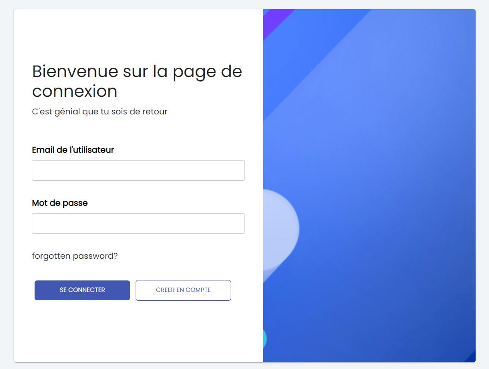

# Web application for student help

    

This web application is made to allow students to answer quizzes and teachers to get the information and the statistics of answers.

Teachers can view statistics in different types of graphs to understand quiz results and student progress.

The authors of this application are Kwaku Antwi Addo, Jean-Charles Coudon, Alexis Soltysiak, Anthony Teye Adjei, Erwan Wattelier and Yunchan Guo.

Here are the instructions for using and understanding our web application.

## Contents

1. [General features](#general-features)
2. [Student features](#student-features)
3. [Teacher features](#teacher-features)
4. [Administrator features](#administrator-features)

## General features

The first thing that appears on your first visit (or if you have logged out) is the home page.

At the top there is a navigation bar with several buttons that will if you are connected or not.

Once you get connected, a navigation bar will appear from the left side if you click on the top-left corner with all the pages to access.

By clicking on the home (here **Outsmarted**) button, you will get a brief summary of the purpose of the application and an image.

    

#### Create an account

The way to create an account depends on the type of user. Please refer to the following links :

- [Create a student account](#create-an-account-for-students)
- [General a teacher account](#create-an-account-for-teacher)
- [Create an administrator account](#create-an-account-for-administrator-and-teacher)

#### Login

By clicking on the login (**Se connecter**) button you can log in the application with your account. To log in, you need to enter your email and your password.

    

#### Profil

Once you get connected to the application, you are automatically redirected to the home page. By clicking on your name on the top-right corner you can access your profil page.

    

You can get information about your email and your rights in the application (student, teacher or administrator).

At the bottom of this page you can change your password, by entering your old password, then the new one, then a confirmation.

#### Log out

When you are connected, you can logout by opening the side navigation bar on the top-left corner and then click on the logout (**Déconnexion**) button on bottom-left corner.

## Student features

#### Create an account (for students)

By clicking on the create an account (**Créer un compte**) button you can create an account.

    

All the conditions for creating an account are explained during creation if you do not comply with them.

The first and last name must be between 3 and 50 characters long, the email must be valid and the password must be between 6 and 50 characters long for security reasons.

A validation email will be sent to the email address, you must click on the link in this email to activate the account and be able to connect.

#### Add a quizz to answer

Open the left navigation bar window and click on the button User to take a quiz (**Utilisateur**).

The student can add a quiz to answer by entering the quiz code (given by the teacher who created the quiz previously) in this page. He will be automatically redirected to the quiz page where he can answer the quiz questions and check off explanations when necessary. He can also see the quizzes he already answered.

    

Here is an example of a quiz snippet :

    

## Teacher features

#### Create an account (for teacher)

Please refer to the administrator account creation which works the same way : [Create admnistrator and teacher account](#create-an-account-for-administrator-and-teacher)

#### Create a new quiz or see quizzes already created

On the navigation bar at the left, the teacher can click on Add quiz (**Ajouter un quiz**) and see quizzes he has already created.

    

#####  See quizzes already created

Here the teacher can click on the quizzes already created by himself and he will get de detail of the quiz :

    

On the top-right corner you can click on Options and you will be able to **edit** or **delete** the quiz.

On the top, the teacher can **close or open** the quizz to answers.

##### Create a new quiz

To create a new quiz, at the topof the page with the list of quizzes already created you can click on Create new quiz (**Créer un nouveau quiz**). A new page will appear :

    

In this page you can dynamically add new questions, new explanations or no explanations for each questions. 

The explanation the teacher writes will appear to the student if he answer "Non", "Plutôt non" or "Plutôt oui".

Once the teacher create the quizz, a code will be automatically generated and display in the screen so the teacher can share the code to the students. By entering this code, the students will be able to answer the quizz if it is open (cf [Answer quiz with student account](#add-a-quizz-to-answer)).

    

#### See and display all the quizzes created

On the left navigation bar, the teacher can click on the questions page (**Page Questions**) button to display all the quizz.

    

Again, you can simply click on a quizz to see the details of the quiz (questions, explanations).

See the answers

On the left navigation bar, by clicking on Answers Page (**Page Reponses**) button you can see the list of the quizzes that have been answered by students.

    

When you hover a quiz two options are available to you : You can see the list of students who answered or you can see the global statistics for thiz quiz.

#####  List of students who answered

    

You can see the details of the answers for each students by clicking on their names.

##### Global statistics for a quiz :

Below are the first type of graphics :

    

And here is the second graph the teacher can see : 

    

You can see the questions in the title of each graph. In addition by hovering the different element on the graph, you can see which explanation corresponds to each answer.

You also have the possibility to change the orientation or the type of the graph as below :

    

#### See the evolution of the answers for one student

On the left side navigation bar, the teacher can also see the evolution of the answers for each student, so he can see his progress or if he is having difficulty. To see this you can click on Student Page (**Page Etudiants**). The list of students who have already answered one quiz will appear.

    

You can then click on a student and on the quiz you want to see statistics. Different curves will appear representing the evolution of the answers for each question. 

    

**Note**, On the y-axis :

- 1 is for "Non"
- 2 is for "Plutôt non"
- 3 is for "Plutôt oui"
- 4 is for "Oui"

## Administrator features

The administrator can do anything that a teacher or a student can do. Here are the options he has in addition.

#### Create an account (for administrator and teacher)

For security reason (prevent students from creating accounts with higher rights), you need an administrator account to create new teacher or administrator account.

When you are logged in as administrator in your left navigation bar you will find a button Admin Dashboard (**Admin Dashboard**) you can click on it. You will be redirected to the administrator page :

    

You can click on the "GO TO" button to go to the creation account page for teachers and administrators.

    

Unlike creating a student account, to create a teacher or administrator account you will need to enter name, first name, email address and then choose a role by clicking on one of the boxes. A temporary password will be automatically generated for the teacher. After validating the account by clinking on the link sent in the verification mail, he can connect to his account and change his password confidentially in his profil page (cf [Profil page](#profil)).

#### Database

The administrator can see what is stored in the database directly in the application with a good-looking page by clicking on **User**, **Quizzes** or **History** in the **Admin Dashboard**.

    

In this page you can display, filter or edit data directly from the database.

